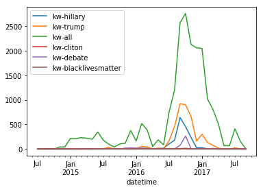
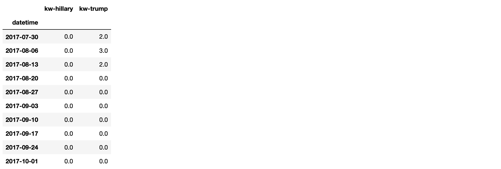
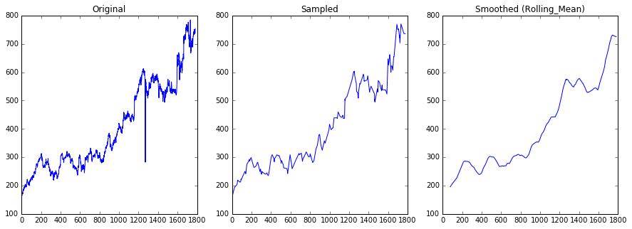
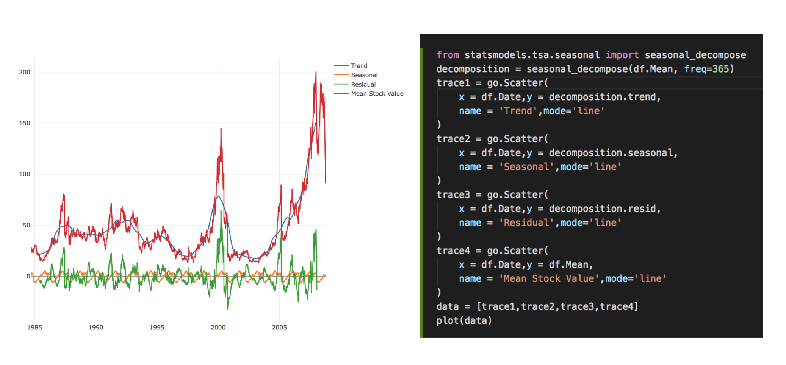

# Week 11: Datetime and Time Series

<div id="toc">

<!-- TOC -->

- [Week 11: Datetime and Time Series](#week-11-datetime-and-time-series)
    - [Objective](#objective)
    - [Datasets](#datasets)
    - [Datetime](#datetime)
        - [Create datetime object](#create-datetime-object)
        - [Convert from string to datetime](#convert-from-string-to-datetime)
            - [Parse ambiguous dates](#parse-ambiguous-dates)
            - [Parse incomplete times](#parse-incomplete-times)
            - [A failed parsing case](#a-failed-parsing-case)
        - [Convert from datetime to utctimstamp and vice versa](#convert-from-datetime-to-utctimstamp-and-vice-versa)
            - [What is a timestamp](#what-is-a-timestamp)
            - [Get a datetime from a timstamp:](#get-a-datetime-from-a-timstamp)
        - [Format a datetime object to string](#format-a-datetime-object-to-string)
            - [Get the present time](#get-the-present-time)
            - [Formating with different style](#formating-with-different-style)
        - [Arithmetics on datetime](#arithmetics-on-datetime)
            - [Compare two datetime object](#compare-two-datetime-object)
            - [Know timedelta object](#know-timedelta-object)
            - [Get difference between two datetime objects](#get-difference-between-two-datetime-objects)
            - [Add timedelta to a datetime object](#add-timedelta-to-a-datetime-object)
        - [Bonus: how to get a datetime object for the current time without microseconds](#bonus-how-to-get-a-datetime-object-for-the-current-time-without-microseconds)
        - [Bonus: Deal with different scales of time durations](#bonus-deal-with-different-scales-of-time-durations)
    - [Time Series Basics](#time-series-basics)
        - [Resample, aggregate and plot](#resample-aggregate-and-plot)
        - [Case: Twitter keywords variation by time](#case-twitter-keywords-variation-by-time)
            - [Sample](#sample)
            - [Resample](#resample)
            - [Bonus: explore resample](#bonus-explore-resample)
            - [aggregate](#aggregate)
            - [plot](#plot)
    - [Time Series Advanced Topics](#time-series-advanced-topics)
        - [Smoothing technique: Moving average](#smoothing-technique-moving-average)
        - [Bonus: Time Series forecasting models](#bonus-time-series-forecasting-models)
    - [References](#references)

<!-- /TOC -->

</div>

## Objective

* Understand the principle of timestamp and datetime format
* Master basic computation on datetime values, including handling timezone conversion
* Understand periodical analysis \(daily, weekly, monthly, seasonal, etc\)

Modules:

* `datetime`
* `dtparser`
* `pandas`
  * basic visualisation using polyline `.plot()`
  * zoom in/ out:  `.resample`, `.aggregate`
* `seaborn`

## Datasets

* [NBC Russian Troll on Twitter dataset](https://www.nbcnews.com/tech/social-media/now-available-more-200-000-deleted-russian-troll-tweets-n844731)
* [Twitter Data](https://github.com/kestrel614/HKODD17-Trump/tree/master/data) of the [Donald & Ivanka Trump analysis](https://initiumlab.com/blog/20170329-trump-and-ivanka/) -- reproduce the charts.
* Financial data usually comes in form of time series, e.g. [Yahoo Finance API](https://github.com/hupili/python-for-data-and-media-communication/blob/master/api-examples/Yahoo%20Finance%20API.ipynb).
* Bitcoin transactions are available via [blockchain.com API](https://www.blockchain.com/api). [A free crypocurrency API](https://min-api.cryptocompare.com/) is available to query the exchange ratio between two symbols.

## Datetime

The *datetime* module supplies classes for manipulating dates and times in the fields like time parsing, formatting or even arithmetic. You can read its document [here](https://docs.python.org/3/library/datetime.html).

### Create datetime object

First we create a datetime object:

```python
from datetime import datetime
dt = datetime(year=1993, month=10, day=4,
              hour=9, minute=8, second=7)
dt
```

Or you can use a positional arguments

```python
from datetime import datetime
dt = datetime(1993, 10, 4, 9, 8, 7)
dt
```

Output:

```text
datetime.datetime(1993, 10, 4, 9, 8, 7)
```

The result is a `datetime` object. A [datetime object](https://docs.python.org/3/library/datetime.html#datetime-objects) is a single object containing all the information from a time point.

### Convert from string to datetime

In many cases, we may need to standardize the format of date/time we scraped from the Internet into datetime objects for further application. We can use `parse` in `dateutil` library. See this case:

```python
from dateutil.parser import parse
dt_1 = parse("Thu Sep 25 10:36:28 2018")
dt_2 = parse('19/May/2017 04:10:06')
dt_3 = parse('2018.2.3')
dt_4 = parse('June 12, 2018')
dt_1, dt_2, dt_3, dt_4
```

Output:

```text
(datetime.datetime(2018, 9, 25, 10, 36, 28),
 datetime.datetime(2017, 5, 19, 4, 10, 6),
 datetime.datetime(2018, 2, 3, 0, 0),
 datetime.datetime(2018, 6, 12, 0, 0))
```

All the time strings in different formats have been transferred into datetime objects. The level of details depends on how explicit the information the raw data provided is.

#### Parse ambiguous dates

In some cases, we may need to parse some ambiguous dates like `parse("10-09-2003")`. We need to give the parameter what the first figure represents:

```python
from dateutil.parser import parse
dt_1 = parse("10-09-2003", dayfirst=True)
dt_2 = parse("10-09-03", yearfirst=True)
dt_1, dt_2
```

Output:

```python
(datetime.datetime(2003, 9, 10, 0, 0), datetime.datetime(2010, 9, 3, 0, 0))
```

#### Parse incomplete times

Many times on the Internet may not be as normative as `2018/12/22`. Instead, many of them are `12/22` or even`Thu 10:36:28`. We can define a default time.

```python
from datetime import datetime 
DEFAULT = datetime(2018, 11, 25)
dt_1 = parse("Thu Sep 10:36:28", default=DEFAULT)
dt_2 = parse("Thu 10:36:28", default=DEFAULT)
dt_3 = parse("12/25", default=DEFAULT)
dt_4 = parse("10:36", default=DEFAULT)
print(dt_1,dt_2,dt_3,dt_4)
```

Output

```text
datetime.datetime(2018, 9, 27, 10, 36, 28),
datetime.datetime(2018, 11, 29, 10, 36, 28),
datetime.datetime(2018, 12, 25, 0, 0),
datetime.datetime(2018, 11, 25, 10, 36)
```

#### A failed parsing case

However, The parsing will fail if we input a time against the regulations.

```python
from dateutil.parser import parse
parse("2月15日 10:36:28")
```

This line will raise a `ValueError`:

```bash
ValueError: ('Unknown string format:', '2月15日 10:36:28')
```

The *dateutil* module provides powerful extensions to the standard *datetime* module. You can check more parse examples [here](https://dateutil.readthedocs.io/en/stable/examples.html#parse-examples)

### Convert from datetime to utctimstamp and vice versa

#### What is a timestamp

The [timestamp](https://docs.python.org/3/library/datetime.html#datetime.datetime.timestamp) is the time in seconds since an *epoch* as a floating point number. The *epoch* is the point where the time starts, and is platform dependent. On Windows and most Unix systems, the epoch is January 1, 1970, 00:00:00 (UTC).

```python
from datetime import datetime, timezone
dt = datetime(
    1993, 10, 4, 9, 8, 7,
    tzinfo=timezone.utc)
ts = dt.timestamp()
ts
```

Output:

```text
749725687.0
#the output figure depends on your current time
```

#### Get a datetime from a timstamp:

```python
from datetime import datetime
datetime.utcfromtimestamp(ts)
```

Output:

```text
datetime.datetime(1993, 10, 4, 9, 8, 8, 12345)
```

Bonus: [UTC](https://en.wikipedia.org/wiki/Coordinated_Universal_Time) (abbreviated from *Coordinated Universal Time*) is the primary  time standard  by which the world regulates clocks and time.

### Format a datetime object to string

#### Get the present time

```python
from datetime import datetime
dt = datetime.now()
ds = dt.isoformat(timespec='seconds',sep=' ')
print(ds,type(ds))
```

Output:

```text
2018-11-19 16:45:44 <class 'str'>
```

- Question: What is the type of `ds`? You can try to change its parameters in `.isoformat()` or remove it to see what will happen.
- You can also use `str(dt)` to transfer a datetime object into string.

#### Formating with different style

In some cases, we may need to convert a datetime into a specific format. Now we can use `strftime()`. Here is an example:

```python
from datetime import datetime
dt = datetime(2018, 11, 20, 14, 0, 0)
print(dt.strftime('%I:%M%p %m/%d(%a),%Y'))
print(dt.strftime('%H:%M:%S %Y/%m/%d'))
```

Output:

```text
02:00PM 11/20(Tue),2018
14:00:00 2018/11/20
```

In this case,`%H` and `%I` represent hour in 24-hour clock and12-hour clock respectively. For 12-hour clock, we use `%p` to get AM/PM from the datetime object. You can click [here](https://docs.python.org/3/library/datetime.html#strftime-strptime-behavior) to see what each parameter represents in `strftime()`.

### Arithmetics on datetime

#### Compare two datetime object

One can perform boolean comparison on `datetime` objects:
```python
from datetime import datetime
result_1 = datetime(2018, 6, 12, 0, 0) > datetime(2018, 2, 3, 0, 0)
result_2 = datetime(2018, 6, 12, 0, 0) == datetime(2018, 2, 3, 0, 0)
result_3 = datetime(2018, 6, 12, 0, 0) < datetime(2018, 2, 3, 0, 0)
print(result_1,result_2,result_3)
```
Output:
```text
True False False
```


#### Know timedelta object

A [timedelta](https://docs.python.org/3/library/datetime.html#timedelta-objects) object represents a duration, the difference between two dates or times. We can build a timedelta object like this:

```python
from datetime import timedelta
td = timedelta(days = 1)
td
```

Output:

```text
datetime.timedelta(days=1)
```

The parameter `days` can be replaced with `seconds`, `microseconds`, `milliseconds`, `minutes`, `hours` and `weeks`. We can also combine them like `timedelta(weeks = 1, days = 2, hours = 12)`.

#### Get difference between two datetime objects

To get the duration between two datetime objects, we can calculate like this:

```python
from datetime import datetime
datetime(2018, 6, 12, 0, 0) - datetime(2018, 2, 3, 0, 0)
```

Output:

```text
datetime.timedelta(days=129)
```

#### Add timedelta to a datetime object

We can also do calculation between a datetime object and a timedelta object.e.g.what is the date 4 weeks later?

```python
import datetime
td_today = datetime.datetime(2018, 11, 19)
#td_today = datetime.date.today()
#td_today = datetime.datetime.now()
td = td_today + datetime.timedelta(weeks = 4)
str(td)
```

Output:

```text
'2018-12-17 00:00:00'
```

In this case, you can use `datetime.date.today()` instead to get the real-time date.

### Bonus: how to get a datetime object for the current time without microseconds

You may have found that `datetime.now()` will return `datetime.datetime(2018, 11, 19, 16, 48, 33, 369859)`. In the former part, we use `dt.isoformat(timespec='seconds',sep=' ')` to omit the **microseconds**, but this method will convert the datetime object into a string.  We can hold the current time as a datetime object for further calculation with these lines:

```python
from datetime import datetime
dt = datetime.now()
dt_without_microseconds = datetime(dt.year,dt.month,dt.day,dt.hour,dt.minute,dt.second)
dt_without_microseconds
```

Output:

```text
datetime.datetime(2018, 11, 19, 16, 41, 15)
```

### Bonus: Deal with different scales of time durations

After we have scape the strings referring to time from a [website](https://www.indeed.com/q-Data-Journalism-Internship-jobs.html), we may need to deal with a group of different scales of time durations:

```python
from datetime import datetime, timedelta
time_list = ['30 Minutes ago','12 Hours ago',
             '4 Days ago','3 Weeks ago',
             '2 Month ago','1 Year ago']
dt = datetime.now()
now = datetime(dt.year,dt.month,dt.day,dt.hour,dt.minute,dt.second)
print('The current time is {}'.format(now))
mylist=[]
for i in time_list:
    if i.lower().find('minute') != -1:
        post_time = now - timedelta(minutes = int(i.split()[0]))
    elif i.lower().find('hour') != -1:
        post_time = now - timedelta(hours = int(i.split()[0]))
    elif i.lower().find('day') != -1:
        post_time = now - timedelta(days = int(i.split()[0]))
    elif i.lower().find('week') != -1:
        post_time = now - timedelta(weeks = int(i.split()[0]))
    elif i.lower().find('month') != -1:
        post_time = now - timedelta(days = int(i.split()[0]) * 30)
    elif i.lower().find('year') != -1:
        post_time = now - timedelta(days = int(i.split()[0]) * 365)
    mylist.append(post_time)
    output = 'The time {} is {}.'.format(i, post_time)
    print(output)
```

Now we get their precise time point. Output:

```text
The current time is 2018-11-19 10:57:50.
The time 30 Minutes ago is 2018-11-19 10:27:50.
The time 12 Hours ago is 2018-11-18 22:57:50.
The time 4 Days ago is 2018-11-15 10:57:50.
The time 3 Weeks ago is 2018-10-29 10:57:50.
The time 2 Month ago is 2018-09-20 10:57:50.
The time 1 Year ago is 2017-11-19 10:57:50.
```


## Time Series Basics

### Resample, aggregate and plot

- Basic requirement: plot time series at different granularity, e.g. by hour, by day, by week, ... Articulate the findings on the polyline plot.
- Checkout [this notebook](https://github.com/hupili/python-for-data-and-media-communication/blob/master/datetime/timeseries.ipynb) for a concrete case of analysing term frequency changes over time in the Tweets.

The core codes are as follows:

```python
df_kws = df.set_index('datetime').resample('1m').aggregate('sum')
df_kws.plot()
```


The key points of plotting time series using pandas:

- First you need to put `datetime` type of data onto index. This usually involves
  - `.apply` a function to [convert from string to datetime](#convert-from-string-to-datetime)
  - `.set_index` to move the `datetime` type from column to index. This is essential step to perform time series operation because later functions all refer to index for the datetime value.
- Use `.resample` to put the data points into different buckets. This is essentially a `.groupby` operation. Instead of working on categorical values like `.groupby`, `.resample` works on datetime ranges. One can specify a time length when performing resample operation, e.g. one week `1w` and two days `2d`.
- Use `.aggregate` to turn the bucket of data points into a single value. This is the same process like [groupby + aggregate](notes-week-08.md#dataframegroupby) approach, but applied on datetime data types.
There is a small missing piece of the above Tweets keyword time series from current discussion. Besides handling the index, you also need to have numeric data on columns, e.g. `kw-hillary` as you can see from the chart. You can checkout [Most Common Names in Tweets](notes-week-10.md#case-3-most-frequent-names-in-tweets) example to see how to encode tweet text into such numeric indicator variables.

### Case: Twitter keywords variation by time

A **time series** is a series of data points indexed (or listed or graphed) in time order. They are very frequently plotted via line charts and used in many fields like statistics, pattern recognition, mathematical finance, weather forecasting, earthquake prediction, astronomy and communications engineering. Check here for more information: [Time series - Wikipedia](https://en.wikipedia.org/wiki/Time_series).
Time series will become more important when we are dealing with the rather bigger datasets. See this case:
```python
import pandas as pd
df = pd.read_csv('https://raw.githubusercontent.com/hupili/python-for-data-and-media-communication/master/text-analysis/regular_reader_tweets.csv')
print('The length of df is {}'.format(len(df)))
df.head()
```
Output:
```
The length of df is 203482
```

Their are more than 200 thousand lines in this dataframe. However, this is the very beginning and we can extract data by different time series from it.

#### Sample

In early stage, we can use `sample()` to return a random sample of items from an axis of object. The sample procedure may lower the reliability but help us deal with large amount of data which are hard for making a census. One can make inferences or extrapolations from the sample to the population. See this step of sampling:

```python
import pandas as pd
df = df.sample(frac=0.1)
print('After sampling, the length of df is {}'.format(len(df)))
df.head()
```

Output:

```python
After sampling, the length of df is 20348
```


We can find that there are 1/10 (because of `frac=0.1`) data have been randomly selected and the data has been disrupted the order. You can also learn more about the regulations of sampling in [pandas official document](http://pandas.pydata.org/pandas-docs/stable/generated/pandas.DataFrame.sample.html#pandas-dataframe-sample).

#### Resample

In `pandas` library, `resample()` is a convenience method for frequency conversion and resampling of time series. Its object  must have a index composed by datetime-like values like Datetime or Timedelta. Therefore, let's first utilise what we learned before to parse these twitts' post time, formatting them into machine recognizable ones:

```python
from datetime import datetime
from dateutil import parser
import numpy
def parse_datetime(x):
    try:
        return parser.parse(x)
    except:
        return numpy.nan
df['datetime'] = df['created_str'].apply(parse_datetime)
```

Now we can use `resample('1W')` to know how many twitts emerged every week.

```python
df.set_index('datetime').resample('1w').aggregate('count').tail()
```

Output:


Notes:

- Setting the 'datetime' column as index is necessary, for `resample()` must have a index composed by datetime-like values.
- `'1W'` is an essential positional argument which means we collect twitts per 7-day period. You can also use the parameters like `'S'`(second), `'Min'`(minute), `'M'`(month), `'SM'`(semi-month) and so forth. You can check [here](https://pandas.pydata.org/pandas-docs/stable/generated/pandas.DataFrame.resample.html) to read more instructions.
- `aggregate('count')` counts how many Tweets posted on a weekly level. We will introduce 'aggregate' in the next part.

#### Bonus: explore resample

In statistics, **resampling** is method for drawing randomly with replacement from a set of data points, including exchanging labels on data points when performing significance tests or validating models by using random subsets. The resampling as a methodology has been widely used in the field of analogue signal processing or audio compression for many years. See its basic mode:

You can learn more about it from [Resampling - Wikipedia](https://en.wikipedia.org/wiki/Resampling_(statistics)).

#### aggregate

The **aggregate** is a process where the values of multiple rows are grouped together. It is aimed to form a single value of more significant meaning or measurement e.g. a sum, a max or a mean.
See how it works in this case:

```python
def has_hillary(t):
    return 'hillary' in str(t).lower()
def has_trump(t):
    return 'trump' in str(t).lower()
df['kw-hillary'] = df['text'].apply(has_hillary)
df['kw-trump'] = df['text'].apply(has_trump)
df.head()
```

Output:


```python
df.set_index('datetime').resample('1w').aggregate('sum').tail()
```

Output:


The sum of each line have been figured. You can check [here](http://pandas.pydata.org/pandas-docs/stable/generated/pandas.DataFrame.aggregate.html?highlight=aggregate#pandas.DataFrame.aggregate) to learn more about what aggregate can do.

#### plot

After resample and aggregate, we can use `plot()` to do the visualisation. Here is an example:

```
df['kw-all'] = df['text'].apply(lambda x: 1)
df.set_index('datetime').resample('1w').aggregate('sum').plot()
```

Output:

You can check out more visual aid analysis in [this notebook](https://github.com/hupili/python-for-data-and-media-communication/blob/master/datetime/timeseries.ipynb). It is a concrete case of analysing term frequency changes over time in the Tweets.

## Time Series Advanced Topics

### Smoothing technique: Moving average

When analysing/ visualising time series, one most common issue is to deal with short period fluctuations. This is especially important in technical analysis of stock price. Stock price can fluctuate a lot in minutes but the fluctuation is less impactful when viewed in the larger time span. We need to smooth the time series curves in order to discover long term trend. `pandas` provides `DataFrame.rolling_mean` and `Series.rolling` to calculate "moving average" (The "MA-xx" curves you see in stock software). The moving average captures the momentum in the data and the crossing of two MAs of different length are usually used as indicators of buy/ sell signals. Checkout [this notebook](https://github.com/mGalarnyk/Python_Tutorials/blob/master/Time_Series/Part1_Time_Series_Data_BasicPlotting.ipynb) for more details.


Image credit: [Michael Galarnyk](https://github.com/mGalarnyk/Python_Tutorials/blob/master/Time_Series/Part1_Time_Series_Data_BasicPlotting.ipynb)

### Bonus: Time Series forecasting models

A time series usually involves several components:

- Trend - the non-repeating movement in the data, e.g. increasing stock price
- Seasonal - repeating movement in the data, e.g. more sells before tax payment period.
- Noise/ residual - other movements that do not belong to the above, e.g. interruptions in the market/ move-the-market news.


Image credit: [Jae Duk Seo](https://towardsdatascience.com/trend-seasonality-moving-average-auto-regressive-model-my-journey-to-time-series-data-with-edc4c0c8284b)

Next question is how to forecast a time series? Predictive analysis is not a requirement from this introductory course. Our main focus is on the descriptive part. Interested readers can checkout the following models from other literatures.

- AR
- MA
- ARMA
- ARIMA

Checkout [this tutorial](https://medium.com/@josemarcialportilla/using-python-and-auto-arima-to-forecast-seasonal-time-series-90877adff03c) for an implementation of ARIMA using `pyramid-arima` (on [pypi](https://pypi.org/project/pyramid-arima/)) and `statsmodels`.

[This tutorial](https://www.analyticsvidhya.com/blog/2016/02/time-series-forecasting-codes-python/) has a more detailed explanation of AR and MA and its decompositions.

Note that the above models are highly simplified presentation of the reality. It works resonably with one-way market like sales forecast, where vendor and consumer have clear roles. It does not work well in stock market price prediction, because the market participants play the counterpart of each other and their predictions affect their behaviour which further affect the market status.

## References

* timestamp usually come in unit of milliseconds \(1/1000\) of a second. [An example](https://github.com/dmep2017/dmep2017.github.io/blob/master/d3-map-sichuan-earthquate/Data Process.ipynb) to parse this timestamp format into `datetime` format.
* Past notes of [datetime](https://github.com/hupili/python-for-data-and-media-communication/tree/master/datetime) from spring 2018.
* Brockwell, Peter J., and Richard A. Davis. Introduction to Time Series and Forecasting. 2nd ed. Springer Texts in Statistics. New York: Springer, 2002.
