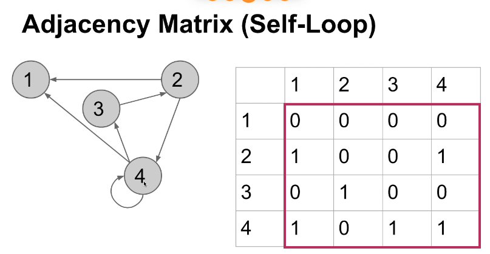
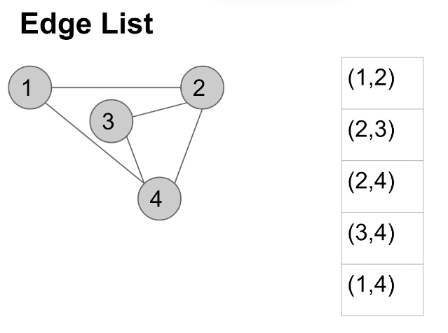
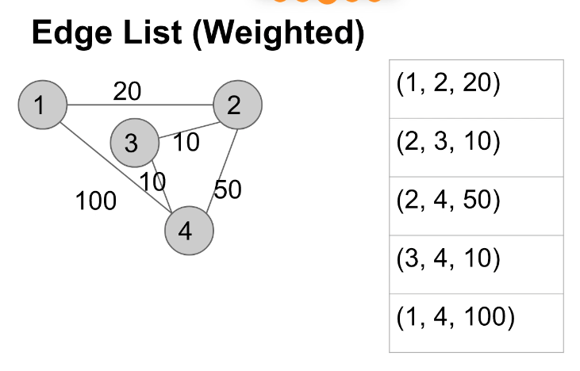
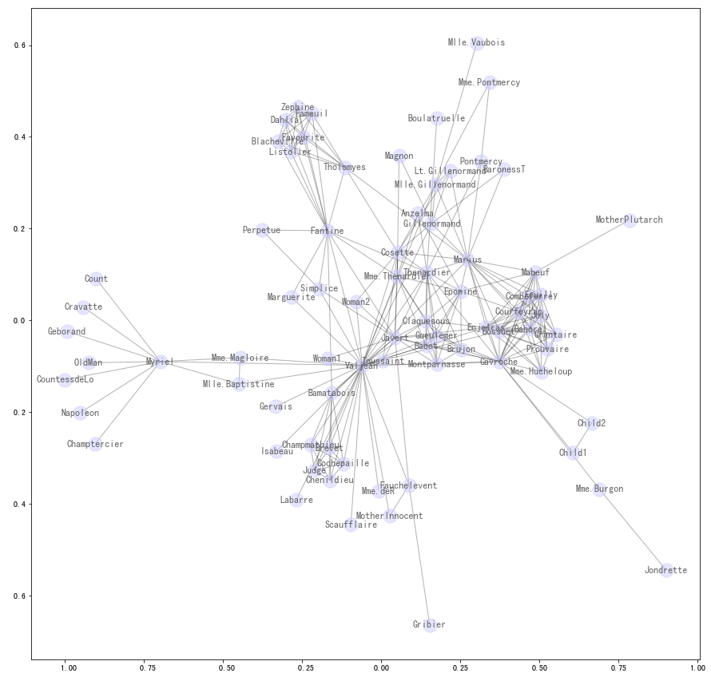
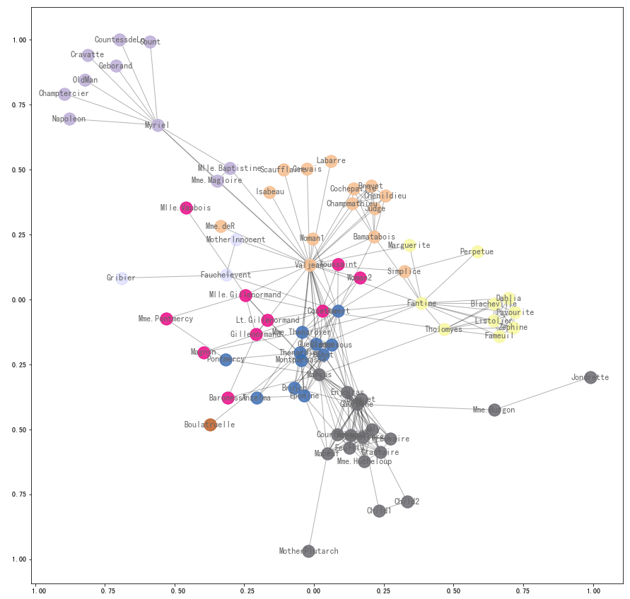
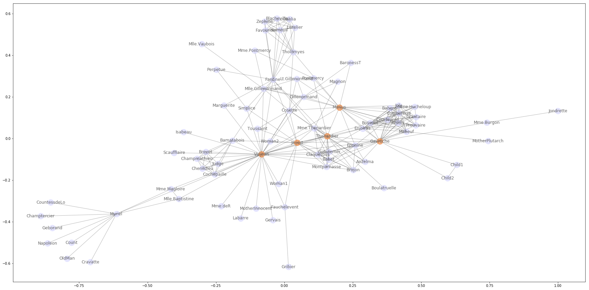
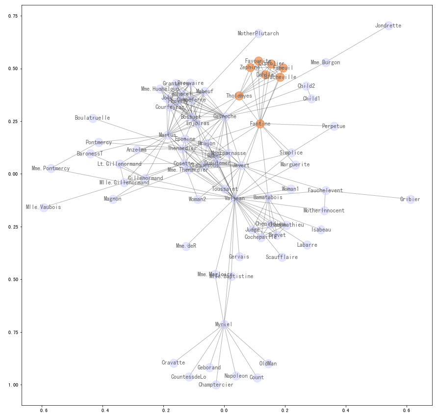
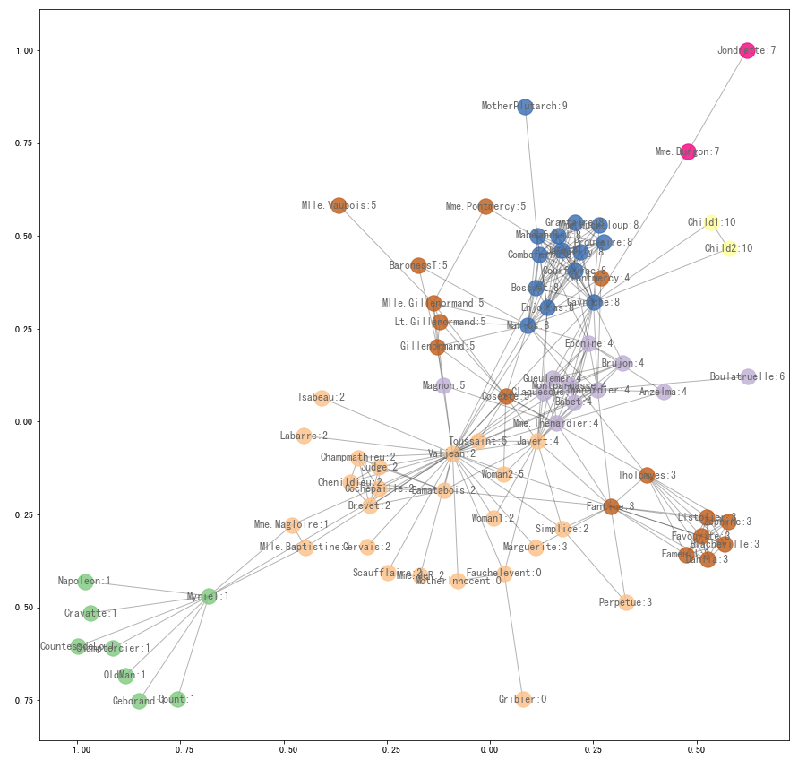
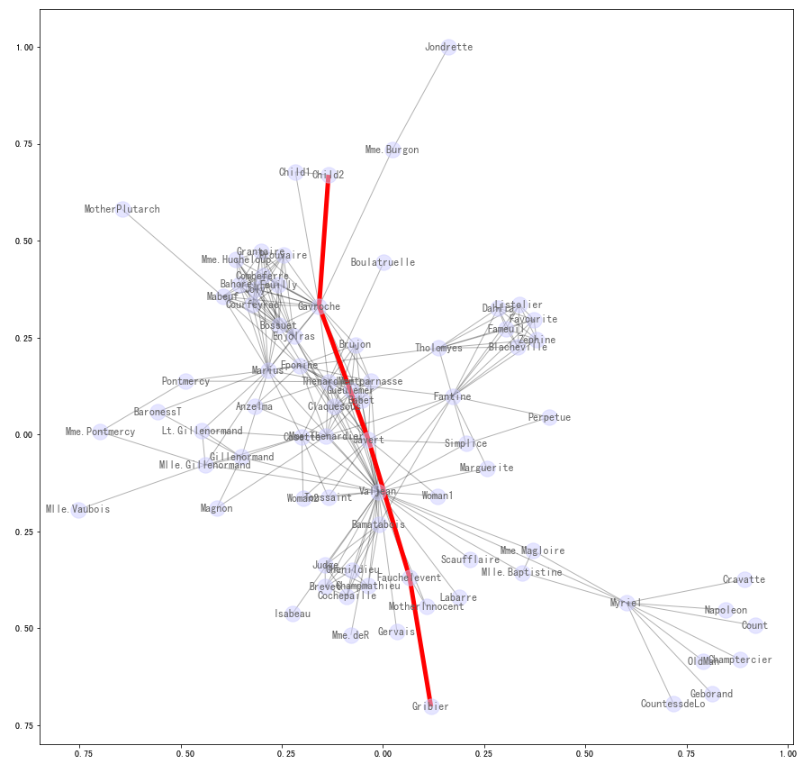

# Week 12: Network data

<div id="toc">

<!-- TOC -->

- [Week 12: Network data](#week-12-network-data)
    - [Graph introduction](#graph-introduction)
    - [Network analysis with NetworkX](#network-analysis-with-networkx)
        - [Basic usage of networkx](#basic-usage-of-networkx)
    - [Common Network Analysis Routine via Les Misérables dataset](#common-network-analysis-routine-via-les-misérables-dataset)
        - [Graph visualization](#graph-visualization)
            - [Basic visualization](#basic-visualization)
            - [Adjust layout](#adjust-layout)
            - [Group the nodes with same color](#group-the-nodes-with-same-color)
        - [Measure Node and Edge Importance](#measure-node-and-edge-importance)
            - [Degree](#degree)
            - [Centrality Measures](#centrality-measures)
        - [Basic statistics of graph](#basic-statistics-of-graph)
            - [Degree distribution](#degree-distribution)
            - [Clustering coefficient](#clustering-coefficient)
        - [Structure of a graph](#structure-of-a-graph)
            - [Cliques](#cliques)
            - [Connected components](#connected-components)
            - [Community detection](#community-detection)
        - [Other Graph algorithms](#other-graph-algorithms)
            - [Shortest path](#shortest-path)
    - [Reference examples](#reference-examples)

<!-- /TOC -->

</div>

## Graph introduction

>Graph theory is the study of graphs, which are mathematical structures used to model `pairwise relations` between objects. A graph in this context is made up of `nodes`, which are connected by `edges`, arcs, or lines. A graph may be `undirected`, meaning that there is no distinction between the two vertices associated with each edge. (from [wiki](https://en.wikipedia.org/wiki/Graph_theory))

There are different kind of graphs.


The criteria to judge whether one graph is the same as others is not the appearance, but the relationship between different nodes.


* Nodes: the fundamental unit of which graphs are formed,also called endpoint. They are connected by the edge like `A` and `B` in above picture.
* Edge：the line that connect two nodes. Each edge has two nodes to which it is attached. Edges may be directed or undirected

Case1: Try to count the edge between those circles.


This undirected table is symmetric. It shows that 1 and 2 has one edge. 2 and 3 is the same, but there is no edge between 1 and 3.

  

While in the directed relationships, like the above picture, 3->2 has one edge, 2->3 has zero edge, this is caused by the edge directions.

There are different ways to show the relationships.

  
  

## Network analysis with NetworkX

### Basic usage of networkx

NetworkX is a Python package for study of the structure, dynamics, and functions of complex networks. With which we can analyze the network structure, the relationship between different nodes and generate different kind of graphs.

Import and install:

```python
!pip install networkx
import networkx as nx
```

Basic usage: From the above explanation, we can know that, the network is formed by nodes and edges. Therefore, when using `networkx`, we need get the nodes and edges first, then we can draw the graph.

```python
#draw an empty graph
g=nx.Graph()
g
#<networkx.classes.graph.Graph at 0x10eb6a1d0>
```

```python
#add nodes
#help(g.add_node) to check out the parameters and syntax
g.add_node('A')
g.add_node('B')
g.add_node('C')
```

It adds the nodes. Then`g.nodes` to check.

```python
g.nodes
#NodeView(('A', 'B', 'C'))
```

Add edges, draw the graph.

```python
#help(g.add_edge) to check out the parameters and syntax
g.add_edge('A','B')
```

Graph show.

```python
nx.draw(g)
```


```python
#add another node between c and b
g.add_edge('C','B')
nx.draw(g)
```

After that, we can get one simple graph.


## Common Network Analysis Routine via Les Misérables dataset

In the following notes, we will use characters in book [*Les Misérables*](https://en.wikipedia.org/wiki/Les_Mis%C3%A9rables) to demo the analysis process. You can download the dataset [here](https://raw.githubusercontent.com/hupili/python-for-data-and-media-communication/master/graph/miserables.json)

### Graph visualization

#### Basic visualization

Add all nodes and edges.

```python
import json
data = json.loads(open('miserables.json').read())
data
#data.keys()
#data['nodes'] checkout nodes
#data['links'] checkout links
import networkx as nx
g = nx.Graph()

#add nodes
for n in data['nodes']:
    g.add_node(n['id'], group=n['group'])

for l in data['links']:
    g.add_edge(l['source'], l['target'])
nx.draw(g)
```


From this graph, we can know that there are some groups, but we don't know who are them. Next step for us is improving the graphs. To solve the following questions:

- Are there some groups in the network?
- Who are in the same group?

#### Adjust layout

Add labels on the graph.

```python
help(nx.draw) #to learn about the function and parameters. What may be useful for us are parameters and see also functions. Those are helpful for optimizing our graphs.
```

```text
    Parameters
    ----------
    G : graph
       A networkx graph
    
    pos : dictionary, optional
       A dictionary with nodes as keys and positions as values.
       If not specified a spring layout positioning will be computed.
       See :py:mod:`networkx.drawing.layout` for functions that
       compute node positions.
    
    ax : Matplotlib Axes object, optional
       Draw the graph in specified Matplotlib axes.
    
    kwds : optional keywords
       See networkx.draw_networkx() for a description of optional keywords.
    
    Examples
    --------
    >>> G = nx.dodecahedral_graph()
    >>> nx.draw(G)
    >>> nx.draw(G, pos=nx.spring_layout(G))  # use spring layout
    
    See Also
    --------
    draw_networkx()
    draw_networkx_nodes()
    draw_networkx_edges()
    draw_networkx_labels()
    draw_networkx_edge_labels()
```

```python
from matplotlib import pyplot as plt

plt.figure(figsize=(15, 15))
pos =nx.spring_layout(g)
# nx.draw(g, pos=nx.spring_layout(g))
nx.draw_networkx_nodes(g, pos, node_color='#ccccff', alpha=0.5) #change nodes style
nx.draw_networkx_edges(g, pos, width=1.0, alpha=0.3) #change edges style
labels = dict([(n, n) for n in g.nodes]) #add labels
_ = nx.draw_networkx_labels(g, pos, labels=labels, font_color='#666666') #draw labels
```



#### Group the nodes with same color

Group the nodes according to the group number in the json.
Every node has a group number, we can group those nodes with the color.

```python
import matplotlib
color = matplotlib.cm.Accent
#import color map, there are many color maps, you can checkout the color maps by the following:
# import matplotlib.cm as cm
# dir(cm)

plt.figure(figsize=(15, 15))
pos =nx.spring_layout(g)
nx.draw_networkx_nodes(g, pos, node_color='#ccccff', alpha=0.5)
nx.draw_networkx_edges(g, pos, width=1.0, alpha=0.3)
labels = dict([(n, n) for n in g.nodes])
_ = nx.draw_networkx_labels(g, pos, labels=labels, font_color='#666666')

for group in range(1, 20):
    nodelist = [n for n in g.nodes if g.nodes[n]['group'] == group]
    # If g.nodes's group = 1, add those nodes into the nodelist. They will be the same color 1 . If g.nodes's group = 2, they will be added to another nodelist ,and be colored 2.
    #print(nodelist)
    nx.draw_networkx_nodes(g, pos, nodelist=nodelist, node_color=color(group), alpha=0.8)
```



### Measure Node and Edge Importance

#### Degree

In graph theory, the degree is the number of edges incident to the nodes. The degree usually represent the **importance** of nodes. Degree can be divided into In-Degree and Out-Degree. In-Degree is how many other nodes point to one node, while Out-Degree is how many other nodes one node points to. Degree is the sum of In-Degree and Out-Degree.

```python
g.degree
pd.Series(dict(g.degree())).hist(bins=20)
```

  
`dict(g.degree())` and then `Series`. Then Draw a picture.

From the histogram, we can see that the minority nodes have large number of edges while majority have less edges.
This is a [Heave tail distribution](https://en.wikipedia.org/wiki/Heavy-tailed_distribution), which is famous for rich will be richer and poor will be poorer.

#### Centrality Measures

<!-- TODO: motivation?? -->

[Centrality](https://en.wikipedia.org/wiki/Centralityis) a classical concept in graph analysis. It measures the "importance" of nodes. The notions of "importance" are different. We only provide some samples in following sections.

You can refer to the [documentation](https://networkx.github.io/documentation/latest/reference/algorithms/centrality.html) and online resources to understand those centrality measures. Try other centrality measures that are not covered in this tutorial. See what interesting findings you can get.

```python
#check out the methods of centrality
nx.degree_centrality(g)
#nx.closeness_centrality(g)
#nx.betweenness_centrality(g)
#nx.eigenvector_centrality(g)

import pandas as pd
df = pd.DataFrame()
df['degree'] = pd.Series(nx.degree_centrality(g))
df['closeness'] = pd.Series(nx.closeness_centrality(g))
df['betweenness'] = pd.Series(nx.betweenness_centrality(g))
df['eigenvector'] = pd.Series(nx.eigenvector_centrality(g))
```

```python
#draw degree centrality
df_top_nodes = df.sort_values('degree', ascending=False)[:5]

plt.figure(figsize=(30, 15))
# we don't run the spring layout again; to keep the positions in this section
#pos =nx.spring_layout(g)
nx.draw_networkx_nodes(g, pos, node_color='#ccccff', alpha=0.5)
nx.draw_networkx_edges(g, pos, width=1.0, alpha=0.3)
labels = dict([(n, n) for n in g.nodes])
_ = nx.draw_networkx_labels(g, pos, labels=labels, font_color='#666666')
nx.draw_networkx_nodes(g, pos, nodelist=list(df_top_nodes.index), node_color='#ff7700', alpha=0.5)

df_top_nodes
#change degree to other three columns to see the different top nodes.
```



From centrality analysis, we can figure out the `key figures` and nodes in the network, and get the next step analysis leads.


<!-- TODO: further reading?? outline.md, notes. Chainsaw's work on Mingpao -->

### Basic statistics of graph

#### Degree distribution

**Todo**

<!-- TODO: what is degree? -->

```python
g.degree
pd.Series(dict(g.degree())).hist(bins=20)
```

  
`dict(g.degree())` and then `Series`. Then Draw a picture.

* Heave tail distribution, which is famous for rich will be richer and poor will be poorer.

<!-- TODO: power law/ prefential attachment/ long tail -->

#### Clustering coefficient

**Todo**

```python
nx.algorithms.clustering(g,['XXX','XXX','XXX'])
nx.average_clustering(g)
```

```python
gorithms.clustering(g, ['Myriel', 'Champtercier', 'Count', 'Cravatte', 'Napoleon', 'Geborand', 'CountessdeLo', 'OldMan'])
# {'Champtercier': 0,
#  'Count': 0,
#  'CountessdeLo': 0,
#  'Cravatte': 0,
#  'Geborand': 0,
#  'Myriel': 0.06666666666666667,
#  'Napoleon': 0,
#  'OldMan': 0}
nx.average_clustering(g)
0.5731367499320134
nx.average_clustering(nx.complete_graph(5))
1.0
```

### Structure of a graph

#### Cliques

We can highlight the certain clique.

```python
cliques = list(nx.find_cliques(g))
#len(cliques)
cliques[0:2]

plt.figure(figsize=(15, 15))
pos =nx.spring_layout(g)
nx.draw_networkx_nodes(g, pos, node_color='#ccccff', alpha=0.5)
nx.draw_networkx_edges(g, pos, width=1.0, alpha=0.3)
labels = dict([(n, n) for n in g.nodes])
_ = nx.draw_networkx_labels(g, pos, labels=labels, font_color='#666666')
nx.draw_networkx_nodes(g, pos, nodelist=cliques[12], node_color='#ff7700', alpha=0.5)
#draw any clique by changing nodelist=cliques[12]
```



#### Connected components

To find those who are not connected by others.

```python
components =list(nx.connected_components(g))
len(components)
```

#### Community detection

**Todo**

```python
from networkx.algorithms import community
communities = list(community.label_propagation_communities(g))
#communities[0]

plt.figure(figsize=(15, 15))
pos =nx.spring_layout(g)
#nx.draw_networkx_nodes(g, pos, node_color='#ccccff', alpha=0.5)
nx.draw_networkx_edges(g, pos, width=1.0, alpha=0.3)

for i in range(0, len(communities)):
    nodelist = communities[i]
    print(nodelist)
    nx.draw_networkx_nodes(g, pos, nodelist=nodelist, node_color=color(i), alpha=0.8)
    labels = dict([(n, '%s:%s' % (n, g.nodes[n]['group'])) for n in nodelist])
    nx.draw_networkx_labels(g, pos, labels=labels, font_color='#666666')
```

  

### Other Graph algorithms

#### Shortest path

Draw the shortest path between two nodes.

```python
sp = nx.shortest_path(g, 'Gribier', 'Child2')
#you can change to any other two nodes
sp

plt.figure(figsize=(15, 15))
#pos =nx.spring_layout(g)
nx.draw_networkx_nodes(g, pos, node_color='#ccccff', alpha=0.5)
nx.draw_networkx_edges(g, pos, width=1.0, alpha=0.3)
labels = dict([(n, n) for n in g.nodes])
_ = nx.draw_networkx_labels(g, pos, labels=labels, font_color='#666666')

nx.draw_networkx_edges(g, 
                       pos,
                       edgelist=list(zip(sp[:-1], sp[1:])),
                       width=5,
                       edge_color='r'
                      )
#help(nx.draw_networkx_edges)
#edgelist:collection of edge tuples
#list(zip(sp[:-1], sp[1:])) check out the edgelist
# [('Gribier', 'Fauchelevent'),
#  ('Fauchelevent', 'Javert'),
#  ('Javert', 'Gavroche'),
#  ('Gavroche', 'Child2')]
```



## Reference examples

* [Who control the discourse power in 红楼梦](https://dnnsociety.org/2018/04/15/who-control-the-discourse-power-in-%E7%BA%A2%E6%A5%BC%E6%A2%A6%EF%BC%9F/) by Group 8 2018S

* [Li's family business map and spring layout analysis](https://dnnsociety.org/2018/04/15/lis-family-business-map-and-spring-layout-analysis/) by Group 7 2018S

------

If you have any questions, or seek for help troubleshooting, please [create an issue here](https://github.com/hupili/python-for-data-and-media-communication-gitbook/issues/new)
