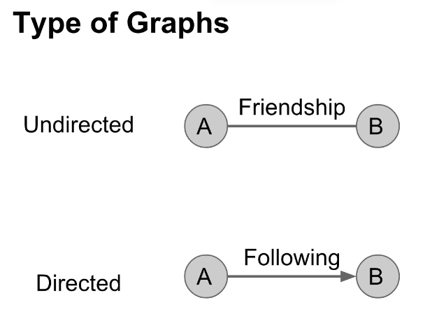
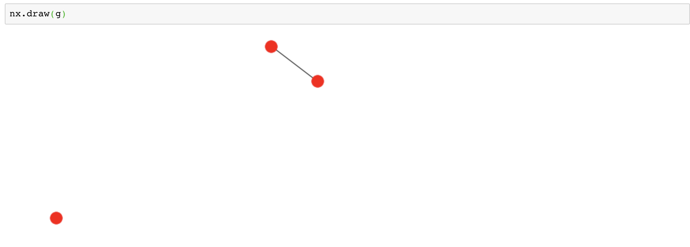
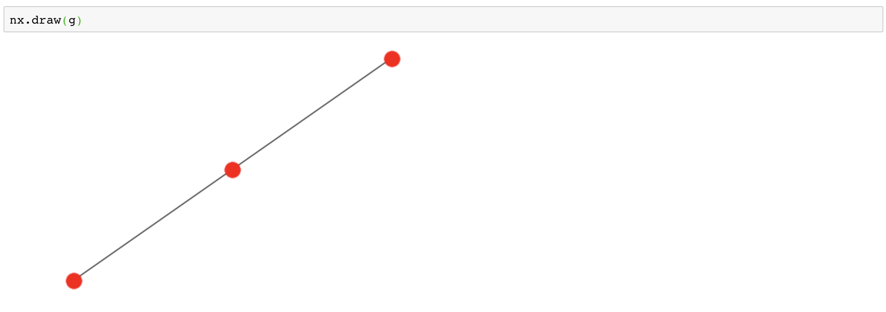

# Week 12: Network data

<div id="toc">
<!-- TOC -->

- [Week 12: Network data](#week-12-network-data)
    - [Graph introduction](#graph-introduction)
    - [Network analysis with NetworkX](#network-analysis-with-networkx)
        - [Basic logic](#basic-logic)
        - [Case with Les Misérables](#case-with-les-misérables)
            - [Visualise the simple graph](#visualise-the-simple-graph)
    - [Visualization Spring layout](#visualization-spring-layout)
    - [Color specific nodes](#color-specific-nodes)
    - [Shortest path](#shortest-path)
    - [Centrality Measures](#centrality-measures)
    - [Structure degree](#structure-degree)
    - [Clustering coefficient](#clustering-coefficient)
    - [Cliques part of the graph](#cliques-part-of-the-graph)
    - [Connected components](#connected-components)
    - [Community detection](#community-detection)
    - [Color the nodes](#color-the-nodes)

<!-- /TOC -->
</div>

## Graph introduction

>Graph theory is the study of graphs, which are mathematical structures used to model `pairwise relations` between objects. A graph in this context is made up of `nodes`, which are connected by `edges`, arcs, or lines. A graph may be `undirected`, meaning that there is no distinction between the two vertices associated with each edge. (from [wiki](https://en.wikipedia.org/wiki/Graph_theory))

There are different kind of graphs.


The criteria to judge whether one graph is the same as others is not the appearance, but the relationship between different nodes.


* Nodes: the fundamental unit of which graphs are formed,also called endpoint. They are connected by the edge like `A` and `B` in above picture.
* Edge：the line that connect two nodes. Each edge has two nodes to which it is attached. Edges may be directed or undirected

Case1: Try to count the edge between those circles.


This undirected table is symmetric. It shows that 1 and 2 has one edge. 2 and 3 is the same, but there is no edge between 1 and 3.

  

While in the directed relationships, like the above picture, 3->2 has one edge, 2->3 has zero edge, this is caused by the edge directions.

There are different ways to show the relationships.

  
  

## Network analysis with NetworkX

### Basic logic

NetworkX is a Python package for study of the structure, dynamics, and functions of complex networks. With which we can analyze the network structure, the relationship between different nodes and generate different kind of graphs.

Import and install:

```python
!pip install networkx
import networkx as nx
```

Basic usage: From the above explanation, we can know that, the network is formed by nodes and edges. Therefore, when using `networkx`, we need get the nodes and edges first, then we can draw the graph.

```python
#draw an empty graph
g=nx.Graph()
g
#<networkx.classes.graph.Graph at 0x10eb6a1d0>
```

```python
#add nodes
#help(g.add_node) to check out the parameters and syntax
g.add_node('A')
g.add_node('B')
g.add_node('C')
```

It adds the nodes. Then`g.nodes` to check.

```python
g.nodes
#NodeView(('A', 'B', 'C'))
```

Add edges, draw the graph.

```python
#help(g.add_edge) to check out the parameters and syntax
g.add_edge('A','B')
nx.draw(g)
```



```python
#add another node between c and b
g.add_edge('C','B')
nx.draw(g)
```

After that, we can get one simple graph.



### Case with Les Misérables

In the following notes, we will use characters in book [*Les Misérables*](https://en.wikipedia.org/wiki/Les_Mis%C3%A9rables) to demo the analysis process. You can download the dataset [here]()

#### Visualise the simple graph

```python
import json
data = json.loads(open('miserables.json').read())
data
#data.keys()
#data['nodes'] checkout nodes
#data['links'] checkout links
import networkx as nx
g = nx.Graph()

#add nodes
for n in data['nodes']:
    g.add_node(n['id'], group=n['group'])

for l in data['links']:
    g.add_edge(l['source'], l['target'])
nx.draw(g)
```


   
 The content is an object.

   
 `json.loads` is to load a string which is given by content. Then data becomes the python structure.

  ```
  type(data)
  data.keys()
  data['nodes']
  data['links']
  ```

     
     
   Check the data. There are many nodes called 'group' and 'ID' and links called 'source' and 'target'.
  ```
  for n in data['nodes']:
  g.add_node(n['id'],group=n['group'])
  ```

  `n['id']` means extracting the id from every item in data\[nodes\], and add them into g.  
  `g.number_of_nodes` and `g.number_of_edges` to check the node.

  ```
  for l in data['links']:
  g.add_edge(l['source'],l['target'], **l)
  ```

  `**l` is an attribute. It means to take every item in 'key-value' pairs. So it equals to

  ```
  l['source'],l['target'], source=0,target=0,value=0
  ```

## Visualization Spring layout

* 'spring layout' is another name for 'force directed layout'.

  ```
  import matplotlib 
  %matplotlib inline
  nx.draw(g)
  ```

  

  ```
  from matplotlib import pyplot as plt
  plt.figure(figsize=(20,20))
  pos=nx.spring_layout(g)
  nx.draw_networkx_nodes(g,pos,node_color='#ccccff',alpha=0.5)
  nx.draw_networkx_edges(g,pos,width=1,alpha=0.3)
  labels=dict([(n,n)for n in g.nodes])
  _=nx.draw_networkx_labels(g,pos,labels=labels,font_color='#666666')
  ```

  

* The above one is the basic graph.

   
 `plt.figure(figsize=(20,20))` to change the size.  
 `nx.draw_networkx_nodes` and `nx.draw_networkx_edges` to draw the nodes and edges.  
 `labels=dict([(n,n)for n in g.nodes])` and `_=nx.draw_networkx_labels` to draw the labels. Create a dict\[\(n,n\)\], whose n is from g.nodes

## Color specific nodes

  ```
  g.nodes['Anzelma']
  ```

    
  We know the content of g.nodes

  ```
  import matplotlib
  color=matplotlib.cm.Accent
  color(10)
  ```

    
  `matplotlib.cm` is a useful tool. You can try by yourself.It shows the R\(red\), G\(green\), B\(blue\) and alpha.

  ```
  for group in range(1,20):
  nodelist=[n for n in g.nodes if g.nodes[n]['group']== group]
  nx.draw_networkx_nodes(g,pos,nodelist=nodelist,node_color=color(group),alpha=0.8)
  ```


 
 If g.nodes's group = 1, add those nodes into the nodelist. They will be the same color 1 . If g.nodes's group = 2, they will be added to another nodelist ,and be colored 2.

## Shortest path

  ```
  sp=nx.shortest_path(g,'XXX','XXX')
  ```

    
  It shows the shortest way between the two nodes.

  ```
  #base on the above graph
  nx.draw_networkx_edges(g,
  pos,
  edgelist=list(zip(sp[:-1],sp[1:])),
  width=5,
  edge_color='r'
  )
  ```

     
   

## Centrality Measures

* **Degree centrality**: degree is the numbers of edges associated with the nodes.
* But not everyone is of the same importance. So **Closeness**  means the shorter the path, relationship is closer. 
* How many times the person be the bridge in the shortest path? This is **Betweenness**. Key messages are in those person.

  ```
  df_top_nodes=df.sort_values('closeness', ascending=False)[:5]
  #basic grah
  nx.draw_networkx_nodes(g,pos,nodelist=list(df_top_nodes.index),
  node_color='#ff7700',
  alpha=0.5)
  ```

     
     
   Sort by closeness.

## Structure degree

  ```
  g.degree
  ```

  

  ```
  pd.Series(dict(g.degree())).hist(bins=20)
  ```

    
  `dict(g.degree())` and then `Series`. Then Draw a picture.

* Heave tail distribution, which is famous for rich will be richer and poor will be poorer.

## Clustering coefficient

  ```
  nx.algorithms.clustering(g,['XXX','XXX','XXX'])
  nx.average_clustering(g)
  ```

  The numbers of triangles over the number of potential triangles .
  
  ```
  nx.average_clustering(nx.complete_graph(5))
  ```

  

## Cliques part of the graph

  ```
  Cliques=list(nx.find_cliques(g))
  ```

  

  ```
  from matplotlib import pyplot as plt
  plt.figure(figsize=(20,20))
  pos=nx.spring_layout(g)
  nx.draw_networkx_nodes(g,
                     pos,
                     node_color='#ccccff',
                     alpha=0.5
                     )
  nx.draw_networkx_edges(g,
                     pos,
                     width=1,
                     alpha=0.3
                     )
  labels=dict([(n,n)for n in g.nodes])
  _=nx.draw_networkx_labels(g,
                   pos,
                   labels=labels,
                   font_color='#666666'
                   )
  ```

  The above is the basic graph. Then

  ```
  nx.draw_networkx_nodes(g,
                       pos,
                       nodelist=cliques[1],
                       node_color='#ff7700',
                       alpha=0.5
                       )
  ```

  

## Connected components

  ```
  components =list(nx.connected_components(g))
  ```

  to find those who are not connected by others.

## Community detection

  ```
  from networkx.algorithms import community
  communities = list(community.girvan_newman(g))
  ```

    
  Those in the community is much denser,and those between the community is sparser.

  ```
  communities = list(community.label_propagation_communities(g))
  ```

  The function is similar.

## Color the nodes

```
plt.figure(figsize=(20,20))
pos=nx.spring_layout(g)
nx.draw_networkx_edges(g,pos,width=1,alpha=0.3)

for i in range(0, len(communities)):
  nodelist=communities[i]
  print(nodelist)
  nx.draw_networkx_nodes(g,pos,nodelist=nodelist,node_color=color(i), alpha=0.8)
  labels=dict([(n, '%s:%s' % (n, g.nodes[n]['group'])) for n in nodelist])
  nx.draw_networkx_labels(g,pos,labels=labels,fint_color='#666666')
```

  

