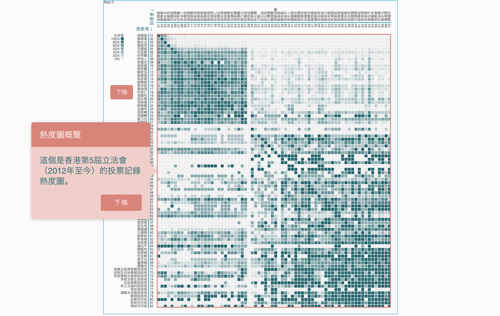
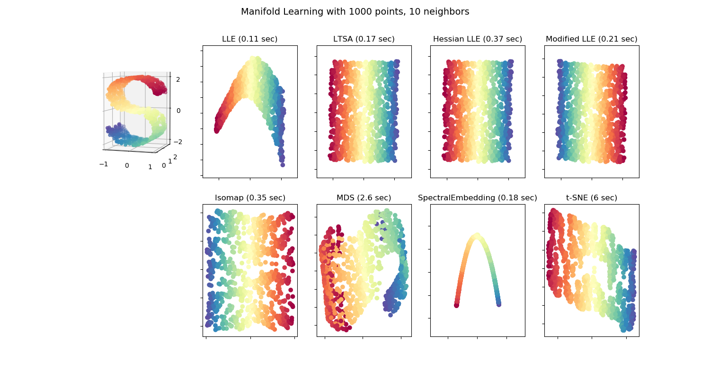

# Week 14: High Dimensional Data

<!-- TOC -->

- [Week 14: High Dimensional Data](#week-14-high-dimensional-data)
    - [Recap of data points and variables](#recap-of-data-points-and-variables)
    - [Measure the similarity between data points](#measure-the-similarity-between-data-points)
    - [Dimensionality Reduction](#dimensionality-reduction)
        - [Principal Component Analysis (PCA)](#principal-component-analysis-pca)
        - [Locally Linear Embedding (LLE)](#locally-linear-embedding-lle)
        - [t-SNE](#t-sne)
        - [Graph Laplacian methods (Spectral Embedding)](#graph-laplacian-methods-spectral-embedding)

<!-- /TOC -->

## Recap of data points and variables

Two flavours of data:

- Social science research, e.g. survey data: many variable; a few data points
- Big data, e.g. user behaviour, server log: many data points; a few variables
  - Some may also get "many variables" but those many variables are usually of the same nature

## Measure the similarity between data points

- inner product
- cosine
- set intersection
- ...

## Dimensionality Reduction

### Principal Component Analysis (PCA)

PCA is one of the earliest **linear** dimensionality reduction algorithm. After dimensionality reduction. One needs to check the "residual energy" to articulate the effectiveness of the algorithm. This is a natural requirement from the definition, where one alternative definition of PCA is "to capture the largest variance in the dataset" -- largest variance means "most energy".

The data-driven report from Initium Media on [5th term of Hong Kong Legislative Council Election](https://theinitium.com/article/20150812-hongkong-legcoanalysis/) uses PCA to calculate the "political spectrum" of the Legco members. Note the "largest variance" in the mathematical formulation of PCA. That variance in Hong Kong turns out to be the political prefernce. The physical meaning of the principal axis comes as an aftermath when we check the members standings on the axis. Mathematics only guarantee "largest variance"; it is our domain knowledge to find the "largest variance" co-incides with political standing, in the case of HK Legco.


Image from [HK Legco interactive heatmap](http://legco.initiumlab.com/matrix).

In the above heat map, the heap map part if simple, how to order the Legco member is a hard problem and PCA was used. The core code is as follows:

```python
from sklearn.decomposition import PCA
pca = PCA(n_components=1)
# X is of dimensions: n_samples x n_features
X_reduced = pca.fit_transform(X)
```

In `sklearn`, there are many "decomposision" methods. The have very similar interface. Just instantiate the object from a chose model with some super parameters, e.g. how many components (dimensions) to keep, and then call `fit_transform()` function to get the reduced dimension results. Many dimensionality reduction methods involve [matrix decomposition](https://en.wikipedia.org/wiki/Principal_component_analysis#Singular_value_decomposition) at a certain step. That is why we get the term "decomposition". It is used as synonym for dimensionality reduction sometimes, because the decomposed version of the matrices are usually of lower dimension.

References:

- 肖超, May 12, 2018, 第六屆香港立法會投票記錄分析（2016-2018）, [LINK](https://dnnsociety.org/2018/05/12/%E7%AC%AC%E5%85%AD%E5%B1%86%E9%A6%99%E6%B8%AF%E7%AB%8B%E6%B3%95%E6%9C%83%E6%8A%95%E7%A5%A8%E8%A8%98%E9%8C%84%E5%88%86%E6%9E%90%EF%BC%882016-2018%EF%BC%89/)
- Initium Lab. “23萬投票紀錄 回顧第五屆香港立法會,” July 30, 2016. [LINK](http://initiumlab.com/blog/20160730-Voting-Preference-Analysis-for-Hong-Kong-Legislative-Council-2012-2016/)
- 胡辟礫, and 巢恬逸. “嶄新展示 —— 立法會數據一目了然.” In 獨家新聞解碼2. 天地圖書, 2017. [LINK](https://dnnsociety.org/wp-content/uploads/2018/03/%E3%80%8A%E7%8D%A8%E5%AE%B6%E6%96%B0%E8%81%9E%E8%A7%A3%E7%A2%BC2%E3%80%8B195-203.pdf)

### Locally Linear Embedding (LLE)

LLE is one of the early non-linear dimensionality reduction algorithm. It captures the intrinsic structure on the low dimension manifold. The selection of super parameter is crucial to the sucessful dimensionality reduction result. The neighbourhood size can not be too large or too small.

The core codes are as follows:

```python
embedding = LocallyLinearEmbedding(n_components=2)
X_transformed = embedding.fit_transform(X[:100])
```

References:

- [Official doc on sklearn-LLE](https://scikit-learn.org/stable/modules/generated/sklearn.manifold.LocallyLinearEmbedding.html)

### t-SNE

[t-Distributed Stochastic Neighbor Embedding (t-SNE)](https://lvdmaaten.github.io/tsne/) is a popular non-linear dimensionality reduction algorithm in recent years. The inerface is very like PCA. Core code:

```python
X = np.array(A)
X_embedded = TSNE(n_components=2).fit_transform(X)
```

Being non-lienar allows t-SNE be able to capture the intrinsic structure. Following is the comparison between different methods. The "S" shape plots data points in original space. On the right hand side are results from several manifold learning algorithms.


Image from [sklearn comparison of manifold learning methods](https://sklearn.org/auto_examples/manifold/plot_compare_methods.html#sphx-glr-auto-examples-manifold-plot-compare-methods-py)


References:

- S2018 students, COMM7780/ JOUR7280, An analysis of recipes from Xia Chu Fang website. [LINK](https://github.com/data-projects-archive/201804-Xia-Chu-Fang/blob/master/final%20assignment/Big%20Data%20Project%20-%20Xiachufang_revised.ipynb)

### Graph Laplacian methods (Spectral Embedding)

Reference:

- Pili Hu, 2014, Spectral Clustering, https://github.com/hupili/tutorial/tree/master/spectral-clustering
